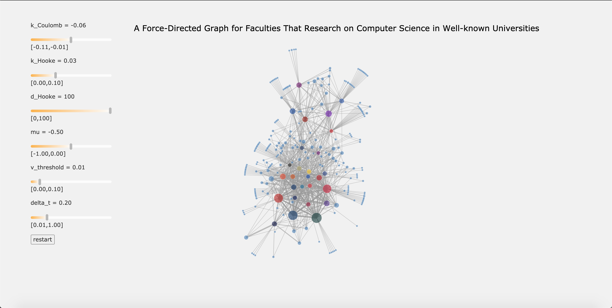
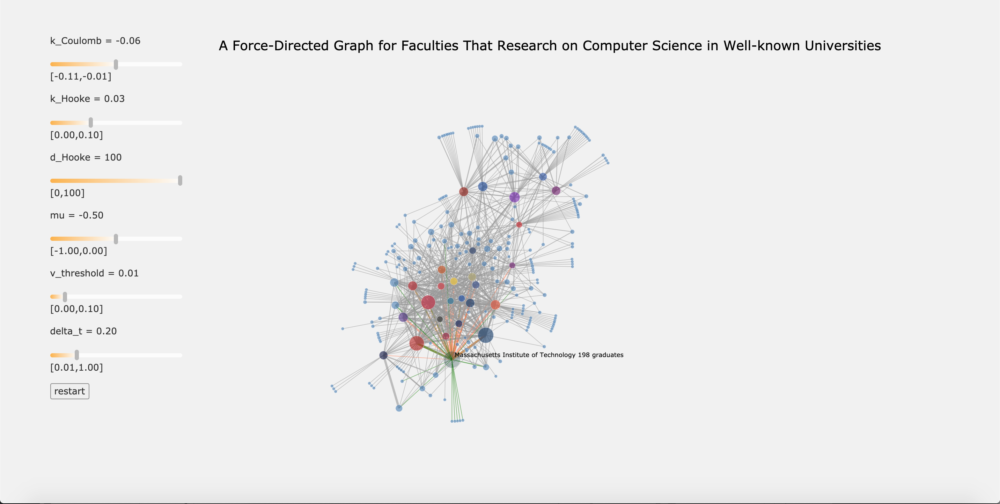
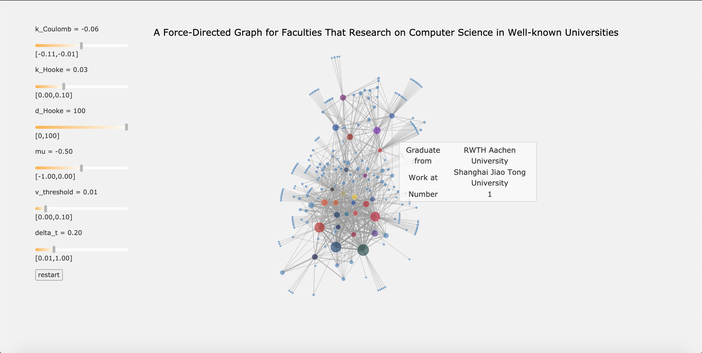
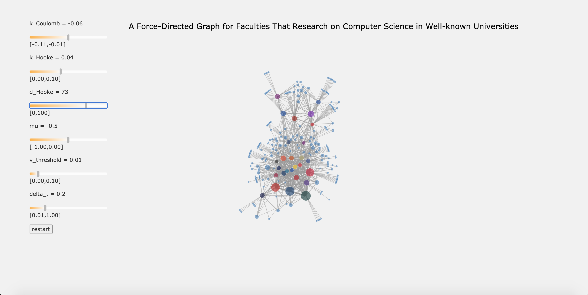
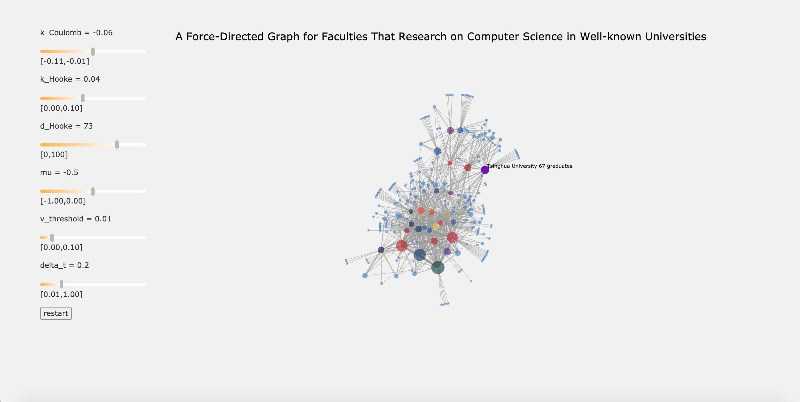
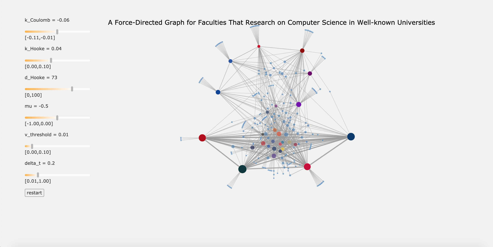
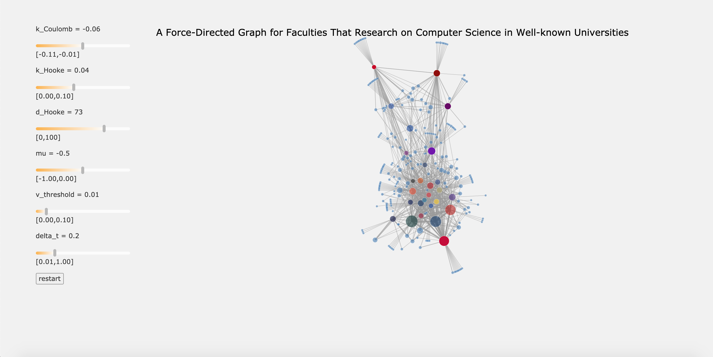

# 可视化与可视计算概论 作业2报告

北京大学信息科学技术学院智能科学系 李泳民 1700012846 芮静姝 1700012799

## 数据描述和分析

   本次任务定义明确，根据CSRankings上的教职毕业学校与其任职学校的流向数据，完成力导向布局可视化。每个`node`拥有`id`(学校名称) 和`weight`(当前教职中毕业于该校的人数) 两个属性，每条`link`拥有`source`(毕业学校名称)，`target` (任职学校名称) 和`weight`(这种流向的人数) 三个属性。

   利用上述数据完成力导向图布局算法，用颜色通道编码学校信息，用透明度通道编码是否选中信息，用边的粗细编码`link.weight`，用点的大小编码`node.weight`。

## 算法的设计与分析

将所有学校看成电性相同的质点，认为学校间的联系可以看成弹簧，然后模拟物理运动以期求得力的平衡点与能量的极小值。

下面不另加说明则$n$代表图中的节点数，$m$代表边数。
这幅图中粗略可以认为$m = O(n)$。

### 力

设计的力包括同性电荷间的斥力、弹簧的弹力和阻力。

**注意**下面的力虽然都是矢量，但只表示与这个方向平行，不说明到底是与该方向共向还是反向。具体的共向/反向需要读者从语境自行体会。
#### 同性电荷斥力
[电荷间的斥力](https://en.wikipedia.org/wiki/Coulomb%27s_law)$\mathbf F_c$为
$$
\mathbf F_c = k_e q_1 q_2 \frac{\mathbf x_1 - \mathbf x_2}{\left|\mathbf x_1 - \mathbf x_2\right|^2}.
$$
其中$k_e$为常量，$q$为电量，而$\mathbf x$为位置。
电量在计算时采用学校的教授数目。

这里和现实中的斥力不同，与距离而非距离的平方成反比。
这一方面是出于计算速度的需求，另一方面也是出于实际效果的需求。

如果斥力与距离的平方成反比，上式中的分母就要换成$\left|\mathbf x_1 - \mathbf x_2\right|^3$，也即需计算$\left|\mathbf x_1 - \mathbf x_2\right|^2$的平方根。
在早期profile中，这是耗时最长的一部分，因为这需要每次循环做$O(n^2)$次开平方根，是完全不能承受的。
而将其改为一次方后，计算所需总时间明显下降,其在profile中耗时也显著下降。

事实上还可换成与距离的三次方成反比的力，但这会造成可视化上巨大的障碍：度为$1$的节点彼此混杂在一起，很难看出与谁相连。
而在与距离成反比的情况下，与同一学校相连的许多度为$1$的学校可以清晰地分团，看出其与哪个学校相关。

#### 弹簧弹力

弹簧的弹力$\mathbf F_s$遵守[Hooke定律](https://en.wikipedia.org/wiki/Hooke%27s_law)：
$$
\mathbf F_s = \tilde k_s \left(\left|\mathbf x_1 - \mathbf x_2\right| - d_s\right) \frac{\mathbf x_1 - \mathbf x_2}{\left|\mathbf x_1 - \mathbf x_2\right|}.
$$
其中$\tilde k_s, d_s$为常量，分别代表常数和弹簧平衡位置。计算中$\tilde k_s$取$k_s \times m_l$，即取$k_s$与学校间来往的教授的数目的乘积。

#### 阻力

为耗散系统能量，避免部分震荡，我们在系统中加入阻力以求稳定。
阻力$\mathbf F_f$遵守
$$
\mathbf F_f = \mu \mathbf v.
$$
其中$\mu$代表阻滞系数，负数时导致阻力。

#### 微小纵向力

该作业生成的力导向图基本呈长方形。为使图片能充分展现，我们曾计划加入一个微小的纵向力使得模型趋于将长轴放在左右方向（显然这是比长轴放在上下方向总能量更低的选择）。具体来说，就是
$$
\mathbf F = c (y - y_\mathrm{middle}).
$$
但这样导致产生结果显著地被压扁，因此我们**放弃该方案**。

### 运动

事实上寻找能量最低的点有很多方法，但这里采用模拟运动的方法，这是因为这个系统缺乏良好的性质，不能用许多更好的方法；而模拟运动是已知行之有效的方法（在现实世界中）。

特别地，这里一定非要计算出速度不可的原因是阻力$\mathbf F_f$的计算需要速度。

上文中我们已经知道如何计算力，于是加速度$\mathbf a$有
$$
\mathbf {F} = m \mathbf a,
$$
其中质量取学校的教授数目。

模拟运动时位置、速度、加速度三者相互以来，这里使用[Beeman's algorithm](https://en.wikipedia.org/wiki/Beeman%27s_algorithm)的predictor-corrector变体来模拟计算。

模拟时将连续的时间模拟为离散的时间，每个时间步的长度为$\Delta t$.
具体公式为
$$
\begin{aligned}
  x(t + \Delta t) &= x(t) + v(t) \Delta t + \frac23a(t)\Delta t^2-\frac16a(t-\Delta t)\Delta t^2,\\
  v_\textrm{predicted}(t + \Delta t) &= v(t) + \frac32 a(t) \Delta t - \frac12 a(t-\Delta t)\Delta t,\\
  a(t + \Delta t) &= f(x(t + \Delta t), v_\textrm{predicted}(v + \Delta t)),\\
  v_\textrm{corrected}(t + \Delta t) &= v(t) + \frac5{12}a(t+\Delta t)\Delta t+\frac23a(t)\Delta t-\frac1{12}a(t-\Delta t).
\end{aligned}
$$
其中由于加速度还依赖速度，在每一步我们先预测出一个速度，然后再产生对应的加速度，最后再校正速度。

这里采用这种模拟的方式在一定程度上也参考了[D3的力导向布局](https://github.com/d3/d3-force)的实现。
我们采用了精度比[Verlet integration](https://en.wikipedia.org/wiki/Verlet_integration)(误差为$O(\Delta t^2)$)更高的Beeman's algorithm(误差为$O(\Delta t^3)$)是为了能放大时间步，在更短的时间步内收敛。
在profile中我们发现Beeman's algorithm所占时间并不显著，因此可以接受。

#### 判断运动终止
判断运动终止即判断是否收敛，采用了判断系统动能的方法。只要系统动能降到一定值以下，就认为系统已经收敛。具体来说，在
$$
\sum_i \frac12 m_i \mathbf v_i^2 \leq \sum_i \frac12 m_i v_0^2
$$
时就认为系统已经收敛，其中$v_0$是临界速度。

### 参数
上述过程中我们描述了$k_e, k_s, d_s, \mu, \Delta t, v_0$这些参数，下面分析它们对图布局的可能影响。这里讨论的都是参数的绝对值大小带来的变化。参数的具体符号需要参照语义决定。

$k_e$越大，显然任意两个节点间的斥力变大，因此节点平衡时的间距会变大，而全图也会因此扩大。存在弹簧且$d_s>0$的时候，这可能导致图的形状发生微妙的变化，但具体的变化可能要参照具体情况来具体分析。

$k_s$越大，会导致弹簧弹力越强，因此会导致节点之间变得更密集，大致与$k_e$的作用相反。

$d_s$越大会导致弹簧的平衡长度越长，这导致节点间距变大。但这放大是导致弹簧长度大致均等地变长，会导致图的形状发生微妙的变化。

$\mu$不影响最终的布局，但影响收敛速度。大致来说，$\mu$越大，图的阻力越大，这一方面阻碍了图的收敛；另一方面却也能阻止剧烈的震荡，因此需要一个适中的值。

$\Delta t$也不影响最终布局，但影响收敛过程。$\Delta t$越小，计算越精确，但这相应地带来速度的损失；相反，如果$\Delta t$特别大，计算会发生剧烈的震荡甚至直接不收敛。一般也要求一个适中的值。

$v_0$越大，收敛时没完成的运动就越多，这可能导致一些不收敛和不整齐，此时图的布局可能就不够美观。


### 速度

为使收敛速度足够快，我们做了一些优化，但基本上都是常数优化而非复杂度优化。

#### 时间复杂度
算法每执行一步，需要计算库伦力$O(n^2)$，计算弹簧弹力$O(m)$，计算阻力$O(n)$，然后进行复杂度为$O(n)$的Beeman's algorithm。
因此每步的复杂度为$O(n^2)$。

事实上我们没有多少步内一定收敛或者运行无穷久就一定收敛的保证，因此只能说，在运行$k$步时，时间复杂度为$O(kn^2)$。

#### 收敛速度
没有收敛速度的保证；事实上，由于这个模型没有足够良好的性质（如凸等），我们甚至没有收敛的保证。

在实验中，随机进行10次运行，均收敛，平均需要343.4ms，标准差10.70ms.
运行时，选取的参数为$k_e = -0.06, k_s = 0.03, d_s = 100, \mu = -0.5, \Delta t = 1, v_0 = 0.1$。
注意运行该测试时**不渲染**。

另外用相同参数跑了一次，得到的`JSON`文件即提交的文件。

浏览器为`Chrome 81.0.4044.138`，机器参数为
```
> uname -srvmo
Linux 5.4.0-53-generic #59-Ubuntu SMP Wed Oct 21 09:38:44 UTC 2020 x86_64 GNU/Linux
> sudo lshw -class CPU
  *-cpu                     
       description: CPU
       product: Intel(R) Core(TM) i7-7700HQ CPU @ 2.80GHz
       vendor: Intel Corp.
       physical id: a
       bus info: cpu@0
       version: Intel(R) Core(TM) i7-7700HQ CPU @ 2.80GHz
       serial: None
       slot: U3E1
       size: 3422MHz
       capacity: 3800MHz
       width: 64 bits
       clock: 100MHz
       capabilities: lm fpu fpu_exception wp vme de pse tsc msr pae mce cx8 apic sep mtrr pge mca cmov pat pse36 clflush dts acpi mmx fxsr sse sse2 ss ht tm pbe syscall nx pdpe1gb rdtscp x86-64 constant_tsc art arch_perfmon pebs bts rep_good nopl xtopology nonstop_tsc cpuid aperfmperf pni pclmulqdq dtes64 monitor ds_cpl vmx est tm2 ssse3 sdbg fma cx16 xtpr pdcm pcid sse4_1 sse4_2 x2apic movbe popcnt tsc_deadline_timer aes xsave avx f16c rdrand lahf_lm abm 3dnowprefetch cpuid_fault epb invpcid_single pti ssbd ibrs ibpb stibp tpr_shadow vnmi flexpriority ept vpid ept_ad fsgsbase tsc_adjust bmi1 avx2 smep bmi2 erms invpcid mpx rdseed adx smap clflushopt intel_pt xsaveopt xsavec xgetbv1 xsaves dtherm ida arat pln pts hwp hwp_notify hwp_act_window hwp_epp md_clear flush_l1d cpufreq
       configuration: cores=4 enabledcores=4 threads=8
```

#### 优化方法
实现该算法的方法我前后试过三种，分别是每隔固定时间调用一次画图函数、在代码中把运算排到最后面来处理异步的画图的问题、让主线程画画，子线程计算。

于是我们的代码选择了最后一种，最终一半在`main.js`，一半在`calc_positions.js`，其中`main.js`负责全部的UI以及这样那样的工作，而`calc_positions`就专门负责计算图像。

我们让`calc_positions.js`向`main.js`发每一步的图像，然后`main.js`再定时去取。这确实影响了它的性能，但这已经是影响性能最少的方式了。

## 可视化结果描述

   进入页面后经过动画出现界面如下

   

   鼠标移至某个点，变淡且显示学校名称和人数；出边（毕业后去其他学校工作）显示为橙色，入边（其他学校毕业后来该校工作）显示为绿色。

   

   鼠标移动到某一条边上，会显示浮窗，提示教职的毕业和工作院校流向和人数

   

   常数及其含义如下

   ```javascript
   let constants = {
       k_Coulomb: -0.06, // k_e
       k_Hooke: 0.03, // k_s
       d_Hooke: 100, // d_s
       mu: -0.5, // mu
       v_threshold: 0.001, // v_0
       delta_t: 0.2, // Delta t
   };
   ```

   可以调整左侧滑条来设置参数，调整后自动重新计算平衡，并有动画过渡；点击restart按钮可以重新从随机分布初始化的点开始计算平衡

   

   拖动某个点，opacity变为1并且这个点停止不动，其余点根据其位置重新计算平衡

   

   拖动多个点后的示例

   

   再次点击被拖动的点，可以解除固定位置，逐一重新计算平衡（重新解除部分固定点的示例如下）

   


## 思考与反思
### 我们从图片想到的
通过饼图对学校机构教师和毕业生来源去向的直观呈现，发现了这样一个特点。一所学校教师来源和学生取向呈现比较明显的长尾效应，特别是在图中人数较多的院校，可能有大概四分之一的教师，其所来源的学校对其目前工作的学校只贡献了屈指可数的一两个毕业生，因而被分到了Other Institution这一类里。

这其实说明，计算机顶级院校，特别是国外院校如CMU、MIT，具有极强的虹吸效应，吸引了各个国家院校的顶尖人才。同时，其毕业生去向也相对比较多元，说明这样知名院校的学生也广受世界各大高校认可。当然，对于很多大学来说，自己大学也是教师的主要来源和毕业生的主要去向，国内一些大学如浙江大学尤为明显。这种情况一方面证明本校对优秀毕业生有足够的吸引力，也对优秀毕业生水平有充足的自信；另一方面也体现了人员流动和多元化还有所不足。

从中，我们能看到：MIT, UCB, Stanford 与 CMU 这四所名校在数据中涉及的毕业生人数是最多的，并且互相往来频繁，从而占据了屏幕中的一大区域。该区域中还包含许多美国高校，如 Cornell, Princeton。而中国的著名大学（包含北京大学、清华大学、南京大学、浙江大学等）则在屏幕另一边，人数相对较少，与国外大学的联系也不如它们本国的大学密切。从中，我们可以清晰地了解每个学校与其他大学的亲近情况。

Carnegie Mellon University、University of California - Berkeley、Stanford University和Massachusetts Institute of Technology四所学校权值最大，相连节点数也极多。

国内大学中，北京大学，清华大学，浙江大学，南京大学，复旦大学，上海交通大学都有较高的权重，并且都和大量的中国学校以及国外学校有关联。

### 我们在这次作业中思考的

本次作业中，我们思考了怎样的图片布局是好的：整体上要能体现出图的对称性和数据分布特性，局部又可以体现出少量数据或单个数据的特点。

力导向图的线条非常多而且重叠严重，所以跟用户的交互——在鼠标选中有效信息的时候通过颜色等视觉通道来强化突出部分信息很关键；
仅仅通过参数设置在局部可能仍然效果不理想，这个时候手动设置固定点就很有效地解决了问题。

